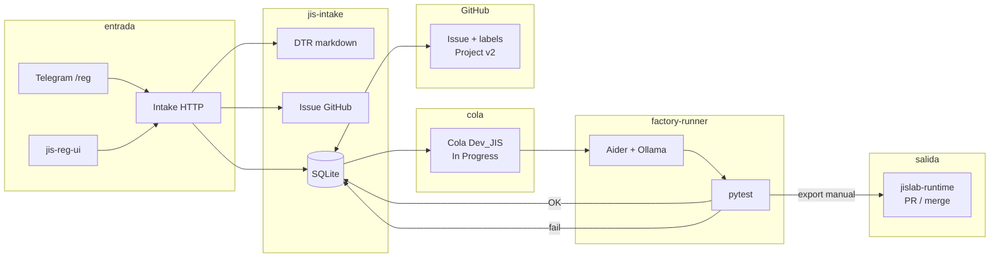

# Factoría de agentes JISPARKING / JISLAB

Repositorio general de la **factoría de desarrollo asistida** (intake, GitHub, runner con Aider/pytest y agentes OpenClaw).  
Repositorio en GitHub: [rodrigocabezasz/jisparking-factoria-agentes](https://github.com/rodrigocabezasz/jisparking-factoria-agentes).

Los entregables de código listos para integración manual se publican aparte en **[jislab-runtime](https://github.com/rodrigocabezasz/jislab-runtime)** (ramas `factoria/<REQ-ID>` y merge a `main`).

**Índice de documentación:** [factoria/INDICE_DOCUMENTACION.md](factoria/INDICE_DOCUMENTACION.md) · **Sincronizar este repo desde el monorepo:** [factoria/PUBLICACION_REPO_GITHUB.md](factoria/PUBLICACION_REPO_GITHUB.md) · Script: `scripts/sync-jisparking-factoria-repo.ps1`.

> **Coherencia:** la guía oficial debe vivir solo en **`factoria/GUIA_OFICIAL_REG_TELEGRAM.md`**. Si existe una copia en la **raíz** del repositorio, eliminala para no romper los enlaces del README.

---

## Flujo completo (visión general)



1. **Entrada:** El requerimiento llega por **Telegram** (`/reg`), por la UI **`jis-reg-ui`** (POST directo a `/telegram/reg`) o por API (`POST /intake`, `/telegram/reg`, `/simple-intake`, webhook Telegram). Ver guía de redacción: [factoria/GUIA_OFICIAL_REG_TELEGRAM.md](factoria/GUIA_OFICIAL_REG_TELEGRAM.md).
2. **jis-intake:** Valida/almacena el pedido, genera el **DTR** (Markdown), crea o enlaza el **issue** en GitHub y guarda estado en **SQLite**.
3. **Auto-encolado:** Tras el alta, por defecto se registra transición **Backlog → In Progress** con actor **`Dev_JIS`** (variable `AUTO_ENQUEUE_DEV_JIS`, por defecto activa). Eso alimenta la cola que consume el runner.
4. **factory-runner:** Hace polling a `GET /dev-jis/pending`, lee el DTR, ejecuta **Aider** sobre el sandbox `/workspaces/dev-jis-work/<REQ-ID>/`, corre **pytest** y llama a `POST /events/state-change` con **Done** (éxito) o **Blocked** (fallo).
5. **GitHub:** Comentarios en el issue y sincronización de **labels** (`status:*`, `qa:passed` en Done) y, si está configurado, **GitHub Project v2** (campo State). Detalle: [factoria/GOVERNANCE_STATE_ACTORS.md](factoria/GOVERNANCE_STATE_ACTORS.md).
6. **Código terminado:** En el servidor queda el sandbox con `src/` y `tests/`. Para llevarlo al repo de terminados se usa el script **`export_dev_jis_to_github.py`** hacia [jislab-runtime](https://github.com/rodrigocabezasz/jislab-runtime) (ver final de este README).

---

## Estados del requerimiento (Kanban / BD / GitHub)

| Estado (intake típico) | Significado | Quién lo suele fijar |
|------------------------|-------------|----------------------|
| **Backlog** | Registrado; aún no encolado a factoría técnica. | Valor inicial al crear el request; o si falló el auto-encolado. |
| **In Progress** | En cola **Dev_JIS** o siendo procesado por **factory-runner**. | Auto tras alta (si aplica) o `POST /events/state-change`. |
| **Done** | pytest OK; sandbox listo para revisión/export. | **factory-runner** (actor `Dev_JIS`). |
| **Blocked** | pytest falló o error en el worker. | **factory-runner** (actor `Dev_JIS`). |

En GitHub, los labels `status:backlog`, `status:in-progress`, `status:done`, `status:blocked`, etc., se intentan alinear con estas transiciones (requiere `GITHUB_TOKEN` y repo configurados en `jis-intake`).

---

## GitHub en el flujo

| Paso | Qué ocurre |
|------|------------|
| Alta del REQ | Se crea un **issue** en el repo configurado (`GITHUB_REPO`); el número de issue se guarda en SQLite. |
| Cada cambio de estado | Opcional: **comentario** en el issue y actualización de **labels** / **Project v2**. |
| Revisión humana | Equipo revisa el issue, el DTR y el código en sandbox o en rama `factoria/...` en **jislab-runtime**. |
| Merge a `main` en jislab-runtime | Código disponible para **clonar en VPS** e integrar en la aplicación productiva (paso manual de despliegue). |

---

## OpenClaw: agentes y rol (skills / identidad)

Los perfiles viven en `openclaw.json` (`agents.list`); cada uno tiene un **workspace** con `SOUL.md` / `AGENTS.md` donde aplica. Modelo por defecto en despliegue típico: **Ollama** (`qwen2.5-coder:14b`).

| ID (config) | Nombre | Rol / skill (resumen) | Herramientas destacadas |
|-------------|--------|------------------------|-------------------------|
| `asistente-jislab` | Asistente JISLAB | Primer contacto técnico; charla general en español; **`/reg`** vía script `factory_reg_post.py` (no inventar URLs). | `group:ui`, `group:runtime`, `exec` en gateway |
| `asistente-jislab-skill` | Asistente JISLAB Skill | Variante orientada a factoría; perfil UI sin `exec` extendido. | `group:ui` |
| `arquitecto-de-soluciones-t-cnicas` | Arquitecto de Soluciones Técnicas | Requerimientos de negocio → documentos técnicos ejecutables (TDD) para el JP. | `group:ui` |
| `jefe-de-proyecto-jislab` | Jefe de Proyecto JISLAB | Orquestación, backlog, infraestructura a alto nivel. | `group:ui` |
| `dba-mysql` | DBA MySQL | Administración, diagnóstico, tuning MySQL; convivencia con skills `.skills/dba-mysql.md` si están montadas. | `group:ui` |
| `desarrollador-backend-jisparking` | Desarrollador Backend JISPARKING | Backend ERP (FastAPI, SQLAlchemy, MySQL) según convenciones del repo. | `profile: full` |
| `frontend-specialist-jisparking` | Frontend Specialist JISParking | Frontend JISParking respetando estructura actual. | `group:ui` |
| `qa-ingenier-a-jislab` | QA Ingeniería JISLAB | Planes de prueba, pytest, criterios de aceptación del DTR. | `group:ui` |
| `ops-despliegue-jislab` | Ops / Despliegue JISLAB | Docker, proxy, VPS, **export del sandbox a GitHub** (ver SOUL del workspace). | `group:ui`, `group:runtime`, `exec` en gateway |
| `monitorizaci-n-jislab` | Monitorización JISLAB | Logs, métricas, alertas, respuesta a incidentes. | `group:ui` |

**Nota:** La ejecución real de código en la factoría la hace **factory-runner** (Aider), no estos agentes. Los agentes ayudan en chat, documentación y operación.

Documentación de workspaces con SOUL explícito:

- [factoria/workspace-asistente-jislab/SOUL.md](factoria/workspace-asistente-jislab/SOUL.md)
- [factoria/workspace-ops-despliegue-jislab/SOUL.md](factoria/workspace-ops-despliegue-jislab/SOUL.md)

---

## Actualizar OpenClaw (quitar aviso de versión en la UI)

Checklist paso a paso: [factoria/PASOS_ACTUALIZAR_OPENCLAW.md](factoria/PASOS_ACTUALIZAR_OPENCLAW.md).  
Contexto adicional: [factoria/WEB_REG_Y_OPENCLAW.md](factoria/WEB_REG_Y_OPENCLAW.md).

---

## Exportar un REQ en estado Done → [jislab-runtime](https://github.com/rodrigocabezasz/jislab-runtime)

Cuando el intake marca **Done** y existen `src/` y `tests/` en el sandbox del runner:

### Script

En el repo: [scripts/export_dev_jis_to_github.py](scripts/export_dev_jis_to_github.py).

### Requisitos

- Repo destino **ya creado** en GitHub (puede estar vacío; el script reintenta clon sin shallow si hace falta).
- **Personal Access Token** con permiso `repo` para push al destino.
- Ejecutar donde exista la ruta del sandbox (típicamente **dentro** del contenedor `factory-runner` o host con el mismo volumen).

### Ejemplo (JISLAB, contenedor factory-runner)

```bash
export GITHUB_TOKEN='ghp_…'   # no compartir

docker cp /tmp/export_dev_jis_to_github.py factory-runner:/tmp/export_dev_jis_to_github.py

docker exec -e GITHUB_TOKEN="$GITHUB_TOKEN" factory-runner python3 /tmp/export_dev_jis_to_github.py \
  --request-id REQ-20260325-0156 \
  --target-repo rodrigocabezasz/jislab-runtime \
  --branch factoria/REQ-20260325-0156
```

GitHub mostrará un enlace para abrir **Pull Request** desde `factoria/<REQ-ID>` hacia `main`. Tras el **merge**, el código queda en [jislab-runtime](https://github.com/rodrigocabezasz/jislab-runtime) listo para clonar en el **VPS de producción** e integrar manualmente.

### Parámetros útiles

| Parámetro | Descripción |
|-----------|-------------|
| `--request-id` / `-r` | ID del requerimiento (ej. `REQ-20260325-0156`). |
| `--target-repo` / `-R` | `owner/repo` destino (ej. `rodrigocabezasz/jislab-runtime`). |
| `--branch` | Por defecto `factoria/<request-id>`. |
| `--src-base` | Por defecto `/workspaces/dev-jis-work`. |

---

## Documentos relacionados en este repo

| Documento | Contenido |
|-----------|-----------|
| [factoria/INDICE_DOCUMENTACION.md](factoria/INDICE_DOCUMENTACION.md) | Índice navegable de toda la documentación factoría. |
| [factoria/PUBLICACION_REPO_GITHUB.md](factoria/PUBLICACION_REPO_GITHUB.md) | Auditoría, árbol mínimo y cómo publicar con el script PowerShell. |
| [factoria/GUIA_OFICIAL_REG_TELEGRAM.md](factoria/GUIA_OFICIAL_REG_TELEGRAM.md) | Cómo redactar un `/reg` (oficial). |
| [factoria/GOVERNANCE_STATE_ACTORS.md](factoria/GOVERNANCE_STATE_ACTORS.md) | Actores Dev_JIS, cola, `AUTO_ENQUEUE_DEV_JIS`. |
| [factoria/openclaw-jislab-map.md](factoria/openclaw-jislab-map.md) | Rutas de `openclaw.json` y enlaces útiles. |
| [factoria/WEB_REG_Y_OPENCLAW.md](factoria/WEB_REG_Y_OPENCLAW.md) | UI `jis-reg-ui`, OpenClaw, chat web. |
| [factoria/PASOS_ACTUALIZAR_OPENCLAW.md](factoria/PASOS_ACTUALIZAR_OPENCLAW.md) | Actualizar imagen OpenClaw (quitar aviso de versión). |
| [factoria/openclaw.json.example](factoria/openclaw.json.example) | Plantilla de gateway/agentes **sin secretos**. |
| [.agents/Req_JIS/intake-message-schema.json](.agents/Req_JIS/intake-message-schema.json) | Schema JSON del intake completo. |
| [.agents/Req_JIS/dtr-template.md](.agents/Req_JIS/dtr-template.md) | Plantilla DTR (referencia). |

---

